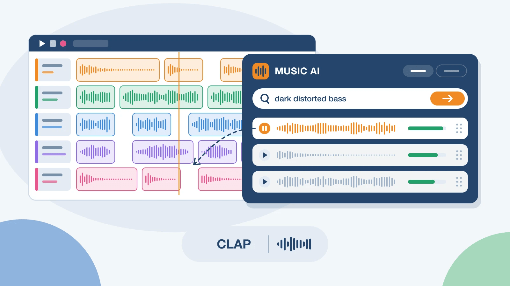
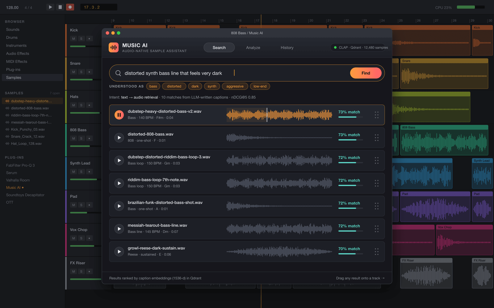
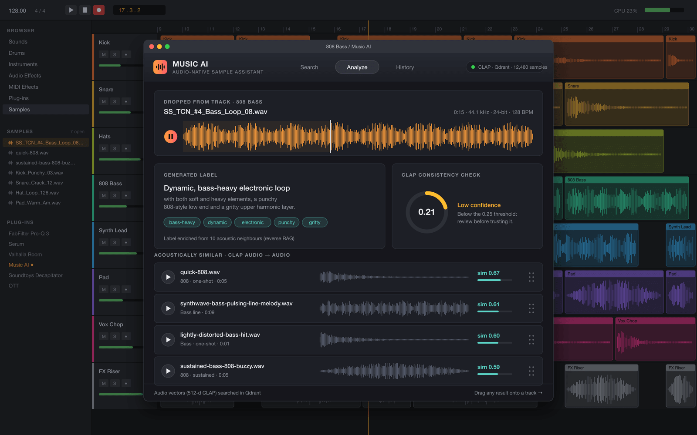
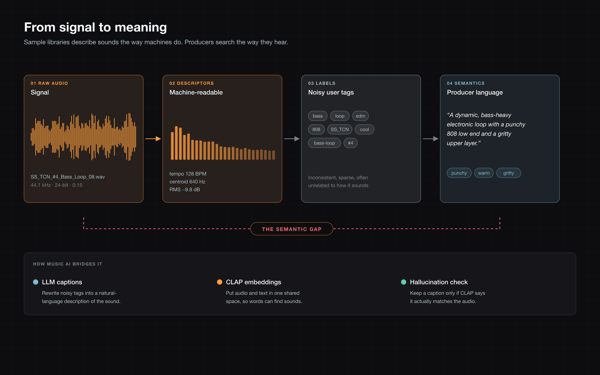
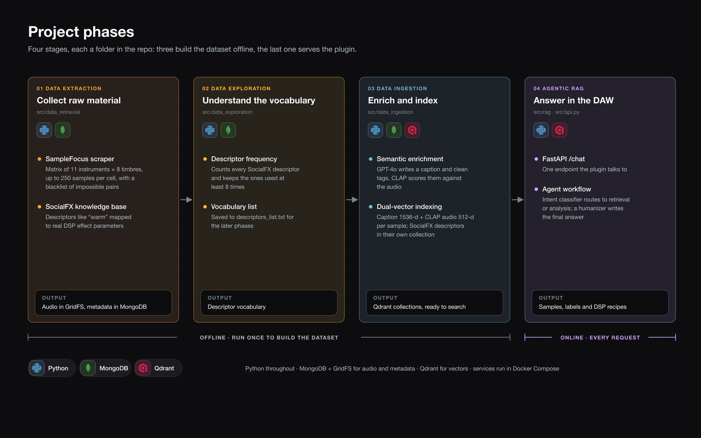
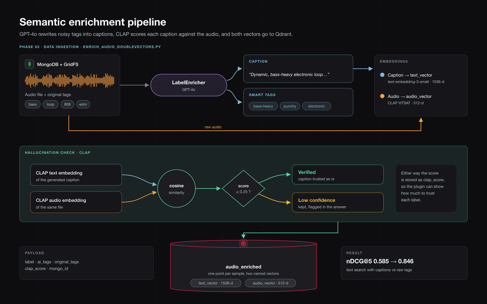
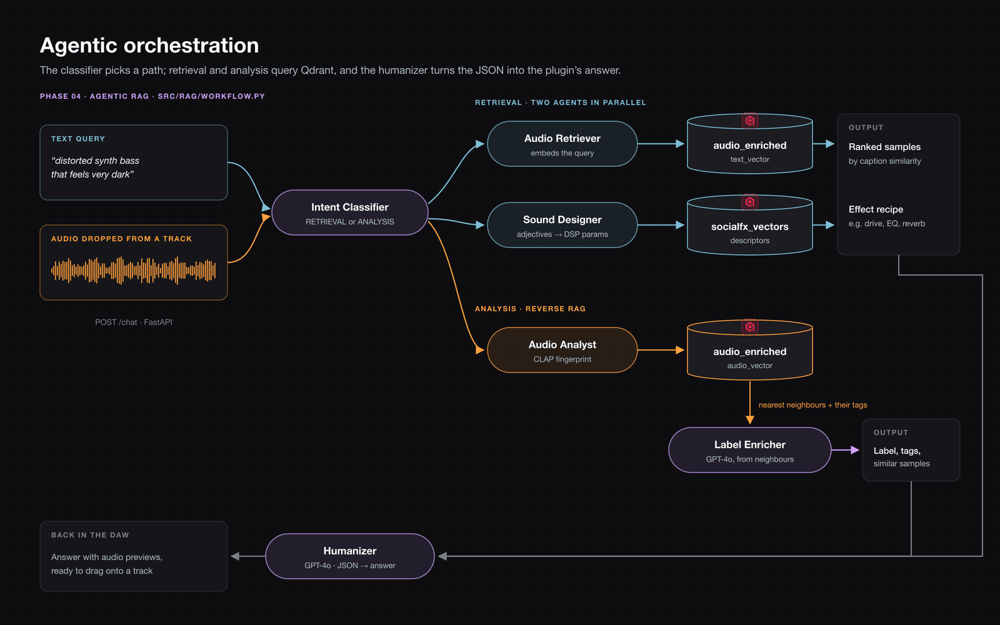

# Music AI: Bridging the Semantic Gap in Audio Retrieval

## Overview

In music production, there is a "semantic gap" between technical, machine-readable metadata and the subjective, perceptual language (e.g., "punchy," "warm") humans use to describe sound. This project bridges that gap using a high-precision, semantically enriched dataset, Large Language Models (LLMs), and Contrastive Language-Audio Pretraining (CLAP) to create an intelligent, Audio-Native Agentic RAG assistant.

---

## Architecture & Codebase

The project is built on a modular, three-layer architecture. The codebase is structured to mirror these layers, handling data ingestion, AI-driven enrichment, and user-facing orchestration:

### 1. Data Layer (Storage & Ingestion)

* **Function:** Handles the ingestion of raw audio samples using a controlled "Matrix Selection Strategy" to balance instrument classes and perceptual descriptors.
* **Implementation:** Relies on a **MongoDB** database, utilizing **GridFS** to efficiently split and store audio binary chunks alongside their raw metadata.

### 2. Semantic Enrichment Layer (Core Intelligence)

* **Function:** Transforms noisy, user-generated folksonomies into structured, natural language captions.
* **Implementation:**
  * **LLM Synthesis & Hallucination Check:** Python-based pipelines that use an LLM to generate captions, followed by a CLAP-based validation step. This checks the cosine similarity between the generated text and the audio signal to prevent hallucinations.

  * **Dual-Vector Indexing:** The validated text vectors (1536-dimensional) and CLAP audio vectors (512-dimensional) are pushed to a **Qdrant** vector database for high-performance similarity search.
    

### 3. Orchestration Layer (Agentic RAG & UI)

* **Function:** A dynamic routing layer that acts as the central nervous system for processing user queries via a Chat UI.
* **Implementation:** A network of specialized AI agents:
  * **Intent Classifier:** Analyzes natural language to route queries to either analysis (Audio-to-Audio) or retrieval (Text-to-Audio) pathways.
  * **Label Retriever & Audio Analyst:** Executes searches against the Qdrant database using semantic textual embeddings or raw acoustic CLAP fingerprints.
  * **Label Enricher (Reverse RAG):** Aggregates tags from the nearest acoustic neighbors to analyze and describe unknown audio signals.
  * **Humanizer Agent:** Translates high-dimensional JSON outputs into actionable UI responses and audio previews.

---

## Key Results

* **Text-to-Audio Semantic Search:** Our Ablation Study proved that substituting raw, noisy tags with LLM-synthesized captions significantly improved retrieval ranking quality, increasing the **nDCG@5 metric from 0.5851 to 0.8460**.
* **Audio-to-Audio Search:** The CLAP-powered analysis successfully bypasses the human "vocabulary mismatch" problem, relying strictly on acoustic features to find highly coherent topological neighbors even when human-assigned tags completely diverge.
